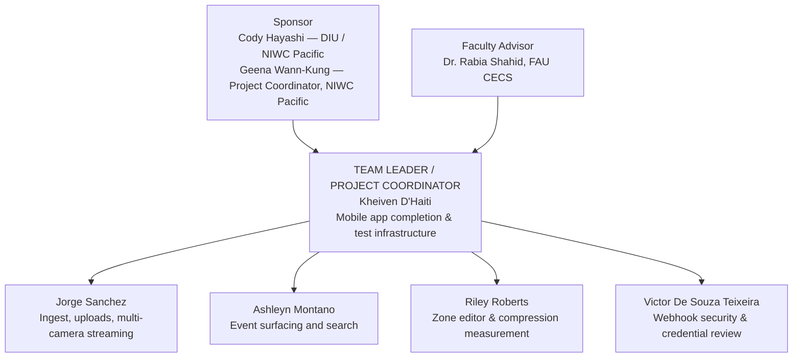

# Revised Proposal — Section 2.7 (Victor De Souza Teixeira)

**Task:** 2.7 — Revised proposal: organizational chart and completed-tasks list
**Owner:** Victor De Souza Teixeira
**Week:** 2 (Sep 7 – Sep 13, 2026)
**Outcome required:** Org chart naming the team leader; list of tasks completed to date

This file is the drop-in content for the two new/updated items in the revised
proposal document (`SVCS Project Revised Proposal`). Per the assignment's
red-line convention, both pieces below should be inserted/marked in red.
Kheiven folds this into the master proposal alongside the other four
sections (2.3–2.6).

---

## 1. Organizational Chart (Team Leader / Project Coordinator)

The assignment requires an organizational chart that explicitly names a team
leader or project coordinator. The existing Fig. 6.1 in the original proposal
shows the technical ownership breakdown but does not use the words "Team
Leader." This chart is the administrative complement to that figure — same
people and reporting lines, labeled the way the assignment asks for.

**Notes for the written proposal:**
- Kheiven D'Haiti is designated **Team Leader / Project Coordinator** for the
  Fall 2026 semester, matching his role as integration lead in Fig. 6.1 and
  his ownership of the master planner (`docs/project-records/PLANNER-FALL-2026.md`)
  and roadmap (`ROADMAP.md`).
- Reporting line: Sponsor and Faculty Advisor sit above the team; the Team
  Leader reports to both and coordinates the four subsystem owners, who each
  report to the Team Leader and continue owning the vertical slice they held
  in Spring 2026 (Table shown in ROADMAP.md, "Ownership follows the subsystem
  each person already held in the spring").
- This chart should be inserted as **Fig. 6.2** (or renumbered per Kheiven's
  final proposal layout) immediately after the existing Fig. 6.1, marked in
  red as a Fall 2026 addition.

---

## 2. Table 4.4 — Tasks and Sub-Tasks Completed to Date

Compiled from `docs/archive/ROADMAP-SPRING-2026.md`, `docs/CHANGES-SUMMER-2026.md`,
and `docs/project-records/PLANNER-FALL-2026.md`. Organized by the three periods
of work completed before this proposal's submission date (Sep 13, 2026).

### 2a. Spring 2026 (Jan 13 – May 6, 2026) — Milestones 1–4, capstone delivered

| Milestone | Deliverable | Status |
|---|---|---|
| M1 (Mar 31) | Core pipeline: dual-CRF ROI encoder, background subtraction, PSNR/SSIM/compression-ratio metrics, SQLite metadata index | Done ✅ |
| M2 (Apr 18) | Super-resolution enhancer, mode dispatch (Modes 0–3), algorithm comparison + stress test, Flask dashboard GUI | Done ✅ |
| M3/M4 (May 6) | AES-256-GCM encryption, HLS live streaming, AV1 codec support, color/object-type metadata, final report, capstone demo | Done ✅ |

**Completed tasks by owner (Spring):**

| Owner | Sub-task | Status |
|---|---|---|
| Kheiven D'Haiti | Background subtraction tuning, CDnet foreground-coverage benchmark | Done ✅ |
| Kheiven D'Haiti | Super-resolution enhancement module + GPU (CUDA/MPS) acceleration | Done ✅ |
| Kheiven D'Haiti | Data integrity validation; Flask dashboard (SSE, all API endpoints) + regression tests | Done ✅ |
| Kheiven D'Haiti | YOLO object-classification gate; mode label/timer overlay; HLS streaming end-to-end | Done ✅ |
| Kheiven D'Haiti | `uv` package-manager migration; final report; capstone demo prep | Done ✅ |
| Jorge Sanchez | ROI/FFmpeg dual-CRF encoding pipeline + 18 integration tests | Done ✅ |
| Jorge Sanchez | Algorithm comparison notebook, stress test, storage extrapolation | Done ✅ |
| Jorge Sanchez | Watchfolder daemon and multi-source RTSP ingestion | Done ✅ |
| Ashleyn Montano | SQLite schema (WAL mode, `idx_cam_time`), `insert_segment()`, camera/time queries + 20 unit tests | Done ✅ |
| Ashleyn Montano | `object_type` field, `query_by_type()`, daily storage summary, multi-type query fix | Done ✅ |
| Riley Roberts | Mode dispatch system (`modes.py`), Mode 1 gating, Mode 2 and Mode 3 implementations | Done ✅ |
| Riley Roberts | `DemoMetadataWriter`, demo renderer, split-screen comparison tool | Done ✅ |
| **Victor De Souza Teixeira** | PSNR, SSIM, compression-ratio metrics (`metrics.py`); `milestone1_benchmark.ipynb` | Done ✅ |
| **Victor De Souza Teixeira** | AES-256-CBC encryption (initial); upgraded to **AES-256-GCM** authenticated encryption (PR #12) | Done ✅ |
| **Victor De Souza Teixeira** | Encrypt/decrypt round-trip and tamper-detection unit tests (24 tests) | Done ✅ |

### 2b. Summer 2026 (May 1 – Aug 18, 2026) — desktop product + Android app

158 commits, 401 files changed, +62,174/-11,278 lines, all pushed. Headline
completed work (team-wide, not individually task-tracked in the spring
format):

| Area | Completed work |
|---|---|
| Distribution | Signed Windows installer (`SVCS-Setup.exe`), Docker server image, Linux AppImage, slim build (4.6 GB → 339 MB) |
| Desktop features | Preset system, ONVIF camera discovery, watchfolder hardening, auto-compress service, disk-budget retention, library UI (Originals/Compressed/All) |
| Compression quality | VMAF-targeted rate control, encoder-level ROI, long-GOP/NVENC/denoise phase, static-scene measurement |
| **Security audit (SEC-001–SEC-016)** | Same-origin CSRF guard, media/library path confinement, encrypt-path confinement, XSS escaping, auth-bypass close, **SSRF input guard on `input_source`** |
| Mobile app | Android companion app built from nothing to **v0.9.0-beta** (4.5 MB APK): live view, library, playback, phone-initiated compression, resumable chunked upload, behavior-alert notifications, **closed-app push via ntfy/UnifiedPush with a second SSRF guard (`push_notify.is_safe_push_url`)** |
| Test coverage | 274 → 1,651 passing tests; 48 → 87 Flask routes across 22 blueprints |
| Server hardening (Android pairing prerequisite) | Non-ASCII credential crash fix, failed-auth throttling, per-device Bearer tokens with per-device revocation, `/api/hls`/`/api/status` RTSP-credential redaction |
| Search/zones/events | Natural-language search, tamper-evident manifests, per-camera exclude zones, line-crossing/loitering behavior events |

### 2c. Fall 2026, Week 1 (Aug 31 – Sep 6, 2026) — ramp-up

| ID | Task | Owner | Status |
|---|---|---|---|
| 1.1 | Review the summer build and audit repository state | Kheiven | Complete Sep 6 |
| 1.2 | Build the fall semester planner | Kheiven | Complete Sep 6 |
| 1.3 | Review spring contributions and current state of the ingest subsystem | Jorge | Complete Sep 5 |
| 1.4 | Team review session on the summer build and fall ownership | Jorge | Complete Sep 6 |
| 1.5 | Review spring contributions and current state of the metadata subsystem | Ashleyn | Complete Sep 5 |
| 1.6 | Team review session on the summer build and fall ownership | Ashleyn | Complete Sep 6 |
| 1.7 | Review spring contributions and current state of the compression modes | Riley | Complete Sep 5 |
| 1.8 | Team review session on the summer build and fall ownership | Riley | Complete Sep 6 |
| **1.9** | **Review my spring contributions and the current state of the security subsystem** | **Victor** | **Complete Sep 5** |
| **1.10** | **Team review session on the summer build and fall ownership** | **Victor** | **Complete Sep 6** |

**All ten Week 1 tasks are complete.** This closes out Phase A ramp-up; the
team enters Week 2 (this reporting period) with Fall ownership confirmed for
all five members (table in `ROADMAP.md`, "Ownership follows the subsystem
each person already held in the spring").

---

## Sources

- `docs/archive/ROADMAP-SPRING-2026.md` — per-person Spring done/open tables
- `docs/CHANGES-SUMMER-2026.md` — summer round-by-round changelog
- `docs/project-records/PLANNER-FALL-2026.md` — Week 1 task IDs and completion dates
- `ROADMAP.md` — Fall 2026 ownership table and Fig. 6.1 equivalent org context

---

*Drafted by Victor De Souza Teixeira for Task 2.7, Week 2, Fall 2026. Not yet
merged into the master proposal document or pushed to `main` — pending
Kheiven's assembly of all five Week 2 sections into the single revised
proposal file before the Sep 13 deadline.*
